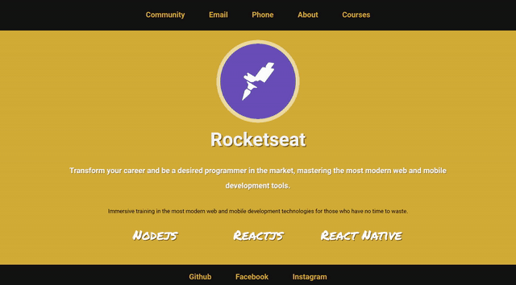

<h1 align="center">
  
</h1>

  
  
  

 <h1 align=center> Challenge 3-2 </h1>

<h1>
  
</h1>

## ✔ About
Updating the files with course information and description dynamically.

Challenge from the Rocketseat <b>LaunchBase<b> course.

---

## ✔ Technologies

Developed using:

 - HTML
 - CSS
 - Javascript

## ✔ Dependencies

 - Nodemon
 - Express
 - Nunjucks

---

Made by Francisco Cruz
