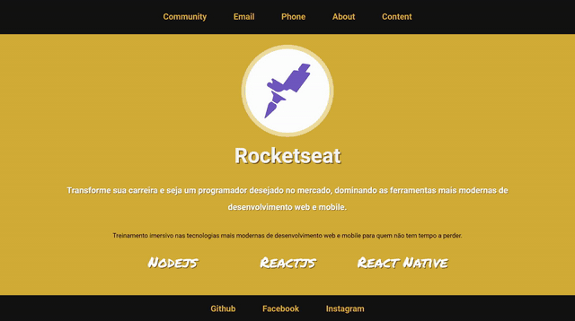

<h1 align="center">
  
</h1>

  
  
  

<h1 align=center> Challenge 2-3 </h1>

<h1>
  
</h1>

## ✔ About
Adding from the challenge 2.2 file, a link called Contents in the header. This page should contain a grid showing the Rocketseat's 3 main courses: Starter, Launchbase and GoStack. When clicking on one of the courses, a modal should be opened where an iframe will load the information of the selected course.

Challenge from the Rocketseat <b>LaunchBase<b> course.

---

## ✔ Technologies

Developed using:

 - HTML
 - CSS
 - Javascript

---

Made by Francisco Cruz
