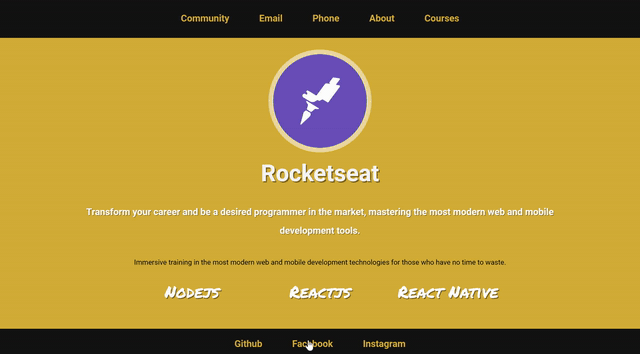

<h1 align="center">
  
</h1>

  
  
  

<h1 align=center> Challenge 3-1 </h1>

<h1>
  
</h1>

## ✔ About
Creating a server that has two routes that must return the content of the html generated in challenge 2-3 (pages of Courses and About). In addition, a standard file (layout.njk) should be implemented that reuses the code in common between these two and also a file that serves a 404 error page.

<i>Error 404 is common to appear on internet pages, when no content was found.</i>

Challenge from the Rocketseat <b>LaunchBase<b> course.

---

## ✔ Technologies

Developed using:

 - HTML
 - CSS
 - Javascript

## ✔ Dependencies

 - Nodemon
 - Express
 - Nunjucks

---

Made by Francisco Cruz

