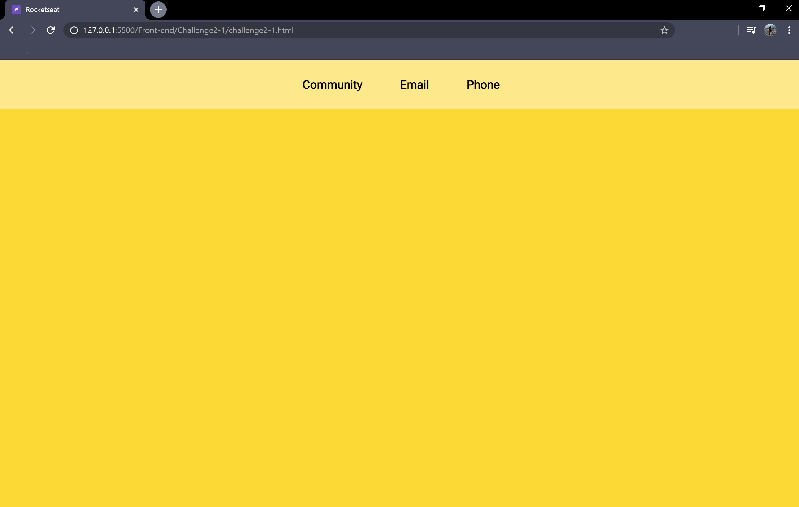

<h1 align="center">
  
</h1>

  

  

<h1 align=center> Challenge 2-1 </h1>

<h1>
  
</h1>

## ✔ About
Creating an html file that contains a favicon and a header with 3 links: Community, Email and Telephone.

Challenge from the Rocketseat <b>LaunchBase<b> course.

---

## ✔ Technologies

Developed using:

 - HTML
 - CSS

---

Made by Francisco Cruz
